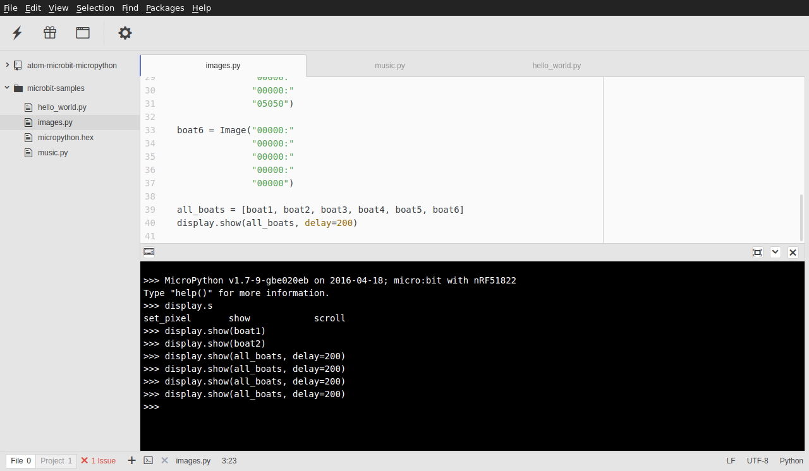

# microbit-micropython package

Atom package to support [micropython](https://microbit-micropython.readthedocs.io/en/latest/) developmentn on the [mircobit](http://microbit.org/).

The package offers the following features:

* Flash microbit with micropython including the current Python file
* Create firmware HEX including micropyton and current Python file
* Serial terminal to micropython REPL
* Configurable trough settings

## Installation

TODO

## Usage

TODO
